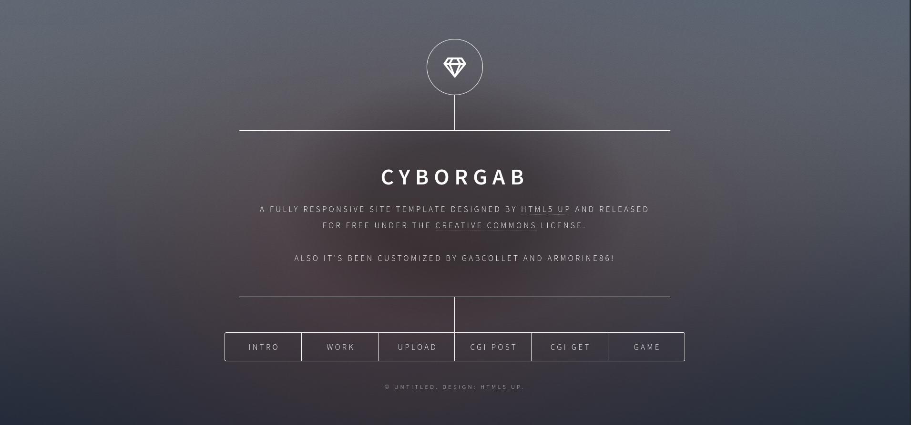

# WebServ

## A 42 project
> 420 - Enhance your calm

---

### Project Score:

The goal of this project is to create your very own HTTP Web Server.
---
[Notion page explaining the project](https://groovy-light-9b7.notion.site/HTTP-Web-Server-0acb4a5e283a4d9ab029827a4e390350)
---

### Authors:

[Armorine86 - Overview](https://github.com/Armorine86)

[gabcollet - Overview](https://github.com/gabcollet)

---

### HTML Template credits:

[https://html5up.net/](https://html5up.net/)

---

---
